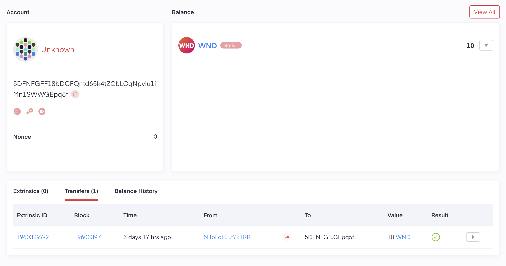

# TO DO

poladotの実装の検証のためのコード

- [x] アカウントの作成（ノーマル）
- [x] メインアカウントとプロキシアカウントの連携 (Add Proxy)
- [x] フォーセットの受け取り
- [ ] プロキシアカウントのtransfer処理による動作確認
- [ ] ステーキングの実施
- [x] 残高の取得
- [ ] ウォレットアプリとの連携
- [ ] 報酬履歴の取得と確認
- [ ] ノミネート処理の実行

# 検証レポート

### metadotでのアカウント作成
アカウント：5DFNFGFF18bDCFQntd65k4tZCbLCqNpyiu1iMn1SWWGEpq5f

