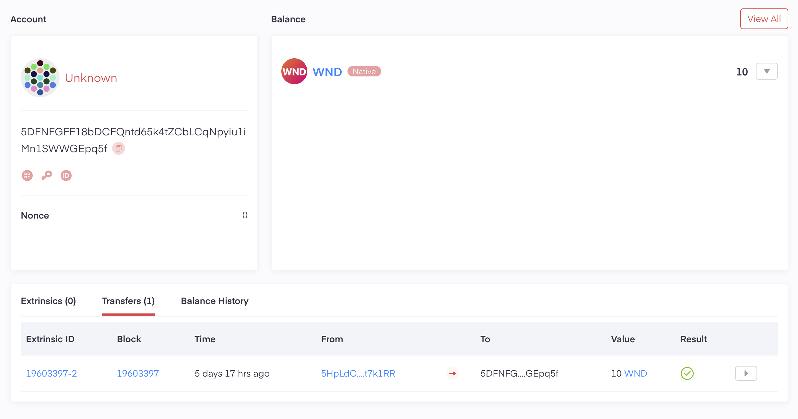
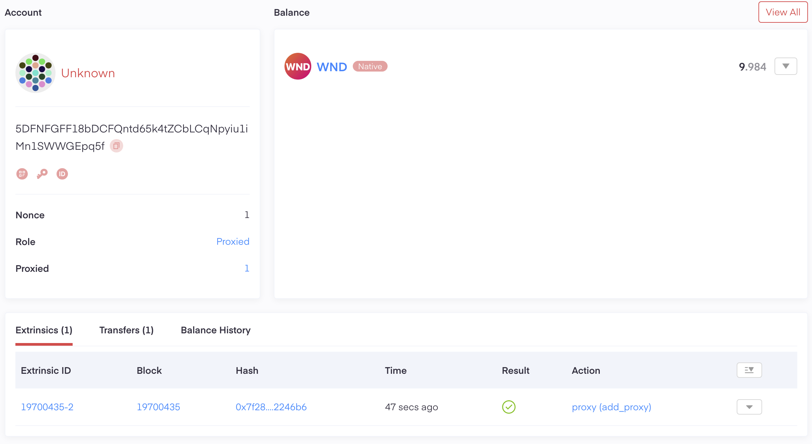
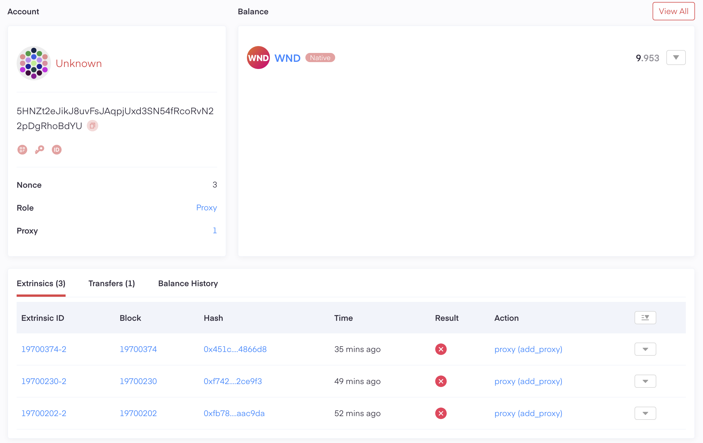

# TO DO

poladotの実装の検証のためのコード

- [x] アカウントの作成（metadotを使用）
- [x] シードフレーズによるアカウントの作成
- [x] メインアカウントとプロキシアカウントの連携 (Add Proxy)
- [x] フォーセットの受け取り
- [x] 残高の取得
- [ ] プロキシアカウントのtransfer処理による動作確認
- [ ] メインアカウントのステーキングの実施
- [ ] ウォレットアプリとの連携
- [ ] 報酬履歴の取得と確認
- [ ] ノミネート処理の実行

---


# metadotでのアカウント作成

アカウント：5DFNFGFF18bDCFQntd65k4tZCbLCqNpyiu1iMn1SWWGEpq5f
フォーセット：10 WND


---

# プロキシアカウントの紐付け

以下の条件で紐付けをする

- メインアカウント: [5DFNFGFF18bDCFQntd65k4tZCbLCqNpyiu1iMn1SWWGEpq5f](https://westend.subscan.io/account/5DFNFGFF18bDCFQntd65k4tZCbLCqNpyiu1iMn1SWWGEpq5f)
- プロキシアカウント: [5HNZt2eJikJ8uvFsJAqpjUxd3SN54fRcoRvN22pDgRhoBdYU](https://westend.subscan.io/account/5HNZt2eJikJ8uvFsJAqpjUxd3SN54fRcoRvN22pDgRhoBdYU)
- 実行プログラム: [addProxy.ts](./addProxy.ts)

## 紐づけに使用される手数料の検証

## プロキシアカウントの残高0の時に行った場合：
以下のようなエラーが発生 → プロキシアカウントに残高が必要となる

```terminal: 実行結果
RPC-CORE: submitAndWatchExtrinsic(extrinsic: Extrinsic): ExtrinsicStatus:: 1010: Invalid Transaction: Inability to pay some fees, e.g. account balance too low
```

## メインアカウントとプロキシアカウントに10WNDある場合：

### 1回目：失敗

```terminal: 失敗
トランザクションがブロック 0x411a71e835f636f86ef80fdf5d2c1a98722e1ab17b2d9e5e42b7828d044565ce に含まれました
```

→ メインアドレスのキーペアを呼ぶときのタイプ指定がされていなかった。

### 2回目：成功

```terminal: 成功
トランザクションがブロック 0xb4c5d2d238aac11919514b4d3a8b52216545f2942ddbb33e9302254177b4939a に含まれました
```

#### 【アカウント残高について】

- 5DFNFGFF18bDCFQntd65k4tZCbLCqNpyiu1iMn1SWWGEpq5f
  - 残高：**9.984364926504** WND
- 5HNZt2eJikJ8uvFsJAqpjUxd3SN54fRcoRvN22pDgRhoBdYU
  - 残高：**9.953094779512** WND
- ブロック情報：
  - 成功分（1回）：使用された手数料：**0.015635073496** WND
  - 失敗分（3回）：使用された手数料：**0.015635073496** WND

#### 【数値の整合性の検証】

$$
\begin{aligned}
9.984364926504 + 9.953094779512 + 0.015635073496 + 0.015635073496*3 \\
= 20
\end{aligned}
$$

#### 【エクスプローラーの検証】

ブロック情報
[0xb4c5d2d238aac11919514b4d3a8b52216545f2942ddbb33e9302254177b4939a](https://westend.subscan.io/block/0xb4c5d2d238aac11919514b4d3a8b52216545f2942ddbb33e9302254177b4939a)

メインアカウントでの表示：成功したことが表示される


プロキシカウントでの表示：失敗は表示されるが、成功は表示されない。


---

## 残高の取得

- [x] アカウントの残高取得（メインもプロキシも）
- [x] メインアカウントとプロキシアカウントの判別
- [ ] それぞれのアカウントのHEX値のコンバート
- [x] 一括取得


## メインアカウントのステーキングの実施

staking.ts で実施

```

```
